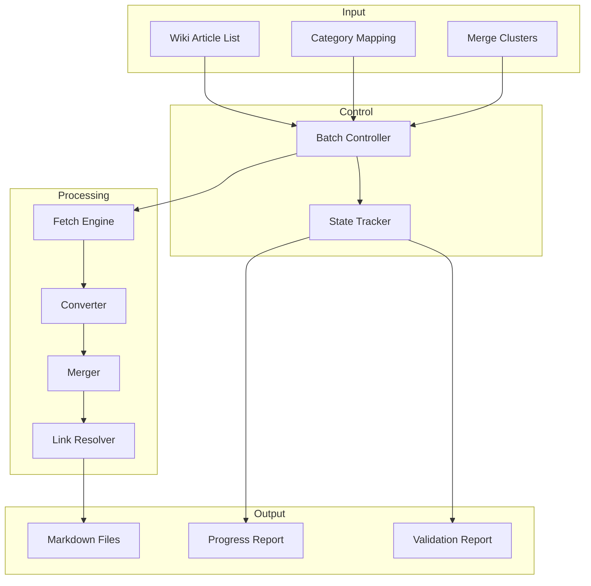
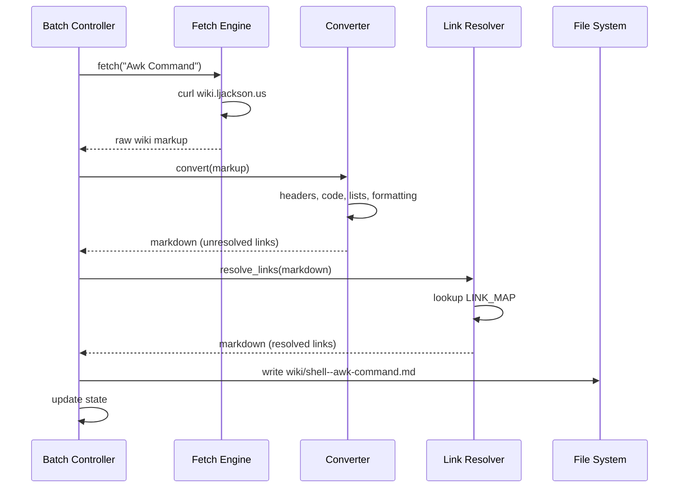
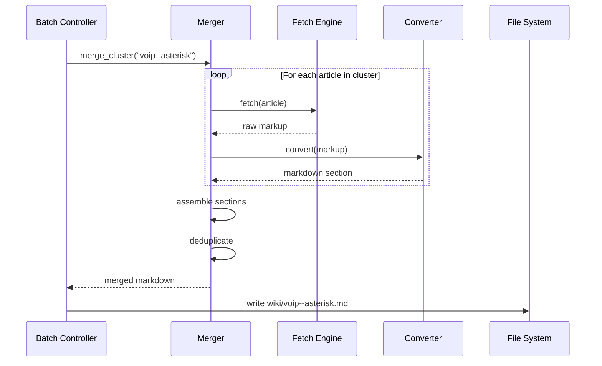

# Wiki Migration - Detailed Design

**Version:** 1.0
**Date:** 2026-01-18
**Status:** Draft

---

## 1. Overview

Migrate ~152 wiki articles from `wiki.ljackson.us` MediaWiki instance to markdown files in the `kwdb` repository. The migration uses a batch-based approach with validation, processing articles in groups of 10-20 with review checkpoints.

### Goals

1. Preserve all wiki content in markdown format
2. Apply consistent category-based naming (`category--topic.md`)
3. Merge related articles into comprehensive documents
4. Convert internal links to relative markdown links
5. Light cleanup of formatting issues
6. Track progress and validate completeness

### Non-Goals

- Full content enhancement/restructuring
- Adding new content
- Updating outdated information

---

## 2. Architecture Overview



---

## 3. Components

### 3.1 Batch Controller

**Purpose:** Orchestrate migration in controlled batches with checkpoints.

**Responsibilities:**
- Load article list and mappings
- Group articles into batches (10-20 per batch)
- Track batch progress
- Pause for review between batches
- Resume from last checkpoint

**Interface:**
```bash
./migrate.sh [--batch N] [--resume] [--dry-run] [--validate-only]
```

**Options:**
| Flag | Description |
|------|-------------|
| `--batch N` | Process batch number N only |
| `--resume` | Continue from last completed batch |
| `--dry-run` | Show what would be done without writing files |
| `--validate-only` | Check completeness without processing |

### 3.2 Fetch Engine

**Purpose:** Retrieve raw wiki content via HTTP.

**Input:** Article title
**Output:** Raw wiki markup string

**Implementation:**
```bash
fetch_article() {
    local title="$1"
    local url_title=$(echo "$title" | sed 's/ /_/g')
    curl -s "http://wiki.ljackson.us/index.php?title=${url_title}&action=raw"
}
```

**Error Handling:**
- Retry 3 times with exponential backoff
- Log failures to `migration.log`
- Continue batch on single article failure

### 3.3 Converter

**Purpose:** Transform wiki markup to markdown.

**Transformations:**

| Wiki Markup | Markdown | Regex/Rule |
|-------------|----------|------------|
| `== Header ==` | `## Header` | `s/^==\s*(.+?)\s*==/## \1/` |
| `=== Header ===` | `### Header` | `s/^===\s*(.+?)\s*===/### \1/` |
| `'''bold'''` | `**bold**` | `s/'''(.+?)'''/**\1**/g` |
| `''italic''` | `*italic*` | `s/''(.+?)''/*\1*/g` |
| `[[Link]]` | `[Link](cat--link.md)` | Link resolver |
| `[[Link|Text]]` | `[Text](cat--link.md)` | Link resolver |
| `[http://url text]` | `[text](http://url)` | `s/\[(\S+)\s+(.+?)\]/[\2](\1)/g` |
| `<pre>...</pre>` | ` ```...``` ` | Block conversion |
| `* item` | `- item` | `s/^\*\s/- /` |
| `# item` | `1. item` | `s/^#\s/1. /` |
| Leading space | Code block | Detect and wrap |
| `[[Category:X]]` | (remove) | Extract for validation |

**Code Block Detection:**
```bash
# Lines starting with space become code blocks
# Group consecutive indented lines
convert_code_blocks() {
    awk '
    /^[ \t]/ {
        if (!in_code) { print "```"; in_code=1 }
        sub(/^[ \t]/, ""); print
        next
    }
    in_code { print "```"; in_code=0 }
    { print }
    END { if (in_code) print "```" }
    '
}
```

### 3.4 Merger

**Purpose:** Consolidate related articles into single documents.

**Input:**
- Primary article content
- List of sub-articles to merge
- Merge structure template

**Process:**
1. Fetch all articles in cluster
2. Extract sections from each
3. Assemble according to template
4. Deduplicate common content
5. Update section headers (demote if needed)

**Merge Clusters Configuration:**
```bash
declare -A MERGE_CLUSTERS=(
    ["voip--asterisk"]="Asterisk Asterisk_Dialplan Asterisk_Echo Asterisk_Firewall Asterisk_Front_End Asterisk_Install Asterisk_Logs Asterisk_Queue Asterisk_Sipgate Asterisk_Tutorial Asterisk_Voice_Changer"
    ["shell--bash"]="Bash Bash_Scripts Bash_Random_Word Bash_Rename_File_Extensions Bash_Sort_IP_Addresses"
    ["misc--firefox"]="Firefox Firefox_Printing Firefox_Profiles Firefox_SVG"
    ["security--scp"]="Secure_Copy_(SCP) Secure_Copy_SCP Mac_OS_X_SCP_(GUI)"
    # ... etc
)
```

### 3.5 Link Resolver

**Purpose:** Convert wiki internal links to markdown relative links.

**Input:** Markdown content with wiki-style links
**Output:** Markdown content with resolved links

**Process:**
1. Extract link target from `[[Target]]` or `[[Target|Display]]`
2. Look up target in category mapping
3. Generate relative path: `category--kebab-case.md`
4. Handle merged articles → use anchor: `category--parent.md#section`

**Link Map Generation:**
```bash
# Generate from article-category-mapping.md
declare -A LINK_MAP=(
    ["SSH"]="security--ssh.md"
    ["Awk Command"]="shell--awk-command.md"
    ["Asterisk Dialplan"]="voip--asterisk.md#dialplan"
    # ... etc
)
```

### 3.6 State Tracker

**Purpose:** Persist migration state for resume capability.

**State File:** `.sop/planning/wiki-migration/state/progress.json`

```json
{
    "version": "1.0",
    "started": "2026-01-18T10:00:00Z",
    "last_updated": "2026-01-18T12:30:00Z",
    "current_batch": 3,
    "total_batches": 10,
    "articles": {
        "Awk Command": {"status": "completed", "output": "wiki/shell--awk-command.md"},
        "SSH": {"status": "completed", "output": "wiki/security--ssh.md"},
        "Asterisk": {"status": "pending", "cluster": "voip--asterisk"},
        "Git": {"status": "failed", "error": "fetch timeout", "retries": 3}
    },
    "statistics": {
        "total": 152,
        "completed": 45,
        "failed": 1,
        "pending": 106,
        "merged": 23
    }
}
```

---

## 4. Data Flow

### 4.1 Single Article Flow



### 4.2 Merge Cluster Flow



---

## 5. Batch Processing

### 5.1 Batch Organization

**Total:** 152 articles → ~10 batches of 15-16 articles

| Batch | Category Focus | Article Count | Includes Merges |
|-------|----------------|---------------|-----------------|
| 1 | shell | 17 | Bash cluster (5→1) |
| 2 | filesystem, networking | 19 | - |
| 3 | security | 9 | SCP cluster (3→1) |
| 4 | voip | 14 | Asterisk cluster (11→1) |
| 5 | windows (part 1) | 13 | GPO cluster (2→1) |
| 6 | windows (part 2) | 12 | - |
| 7 | web, database | 9 | PHP cluster (2→1) |
| 8 | media | 11 | Ivtv cluster (2→1) |
| 9 | graphics | 12 | - |
| 10 | config, misc (part 1) | 18 | - |
| 11 | misc (part 2) | 18 | Firefox, Excel clusters |

### 5.2 Batch Execution

```bash
# Run single batch
./migrate.sh --batch 1

# Output:
# Batch 1/11: shell category (17 articles)
# ----------------------------------------
# [1/17] Fetching: Awk Command
# [1/17] Converting: Awk Command → shell--awk-command.md
# [1/17] ✓ Complete
# [2/17] Fetching: Bash (merge cluster: 5 articles)
# [2/17] Converting: Bash cluster → shell--bash.md
# [2/17] ✓ Complete (merged 5 articles)
# ...
# ----------------------------------------
# Batch 1 complete: 17 articles → 13 files
# Review files in wiki/ then run: ./migrate.sh --batch 2
```

### 5.3 Review Checkpoint

After each batch:
1. Script pauses and displays summary
2. User reviews generated files in `wiki/`
3. User can:
   - Continue to next batch: `./migrate.sh --batch N+1`
   - Re-run current batch: `./migrate.sh --batch N`
   - Fix issues manually and continue

---

## 6. Validation

### 6.1 Pre-Migration Validation

```bash
./migrate.sh --validate-only

# Checks:
# - Wiki server accessible
# - All articles in mapping exist on wiki
# - Category mapping complete (no unmapped articles)
# - Merge clusters valid (all members exist)
# - Output directory writable
```

### 6.2 Per-Article Validation

| Check | Description | Action on Failure |
|-------|-------------|-------------------|
| Fetch success | HTTP 200, non-empty content | Retry 3x, then skip |
| Markup detected | Contains wiki markup patterns | Warn, continue |
| Links resolved | All `[[...]]` converted | Warn with list |
| No HTML artifacts | No `<div>`, `<span>` remnants | Warn, manual review |
| File written | Output file exists, non-empty | Error, halt batch |

### 6.3 Post-Migration Validation

```bash
./migrate.sh --validate-only --post

# Checks:
# - All expected files exist in wiki/
# - No duplicate content (fuzzy match)
# - All internal links resolve to existing files
# - Category distribution matches mapping
# - Merge clusters fully consolidated
# - No orphaned articles
```

### 6.4 Validation Report

**File:** `.sop/planning/wiki-migration/state/validation-report.md`

```markdown
# Migration Validation Report
Generated: 2026-01-18T14:00:00Z

## Summary
- Total articles: 152
- Successfully migrated: 150
- Failed: 2
- Final files: 142

## Failed Articles
| Article | Error | Suggested Action |
|---------|-------|------------------|
| E61i | Fetch timeout | Retry manually |
| Strototime | Empty content | Verify on wiki |

## Link Resolution
- Total internal links: 234
- Resolved: 230
- Unresolved: 4

### Unresolved Links
- wiki/security--ssh.md: [[Telnet]] (article doesn't exist)
- wiki/misc--firefox.md: [[Mozilla]] (article doesn't exist)
...

## File Inventory
✓ 142 files in wiki/
✓ All categories represented
✓ All merge clusters consolidated
```

---

## 7. Error Handling

### 7.1 Error Categories

| Category | Examples | Handling |
|----------|----------|----------|
| Network | Timeout, connection refused | Retry with backoff |
| Content | Empty article, malformed markup | Log warning, continue |
| Filesystem | Permission denied, disk full | Halt with error |
| Logic | Unmapped article, circular merge | Halt with error |

### 7.2 Retry Strategy

```bash
MAX_RETRIES=3
RETRY_DELAY=(1 5 15)  # seconds

fetch_with_retry() {
    local title="$1"
    for ((i=0; i<MAX_RETRIES; i++)); do
        if content=$(fetch_article "$title"); then
            echo "$content"
            return 0
        fi
        sleep "${RETRY_DELAY[$i]}"
    done
    return 1
}
```

### 7.3 Recovery

- **Resume:** `./migrate.sh --resume` continues from last successful article
- **Retry failed:** `./migrate.sh --retry-failed` attempts only failed articles
- **Manual fix:** Edit state file to mark articles as completed after manual processing

---

## 8. File Structure

```
kwdb/
├── wiki/                              # Migrated articles
│   ├── shell--awk-command.md
│   ├── shell--bash.md
│   ├── security--ssh.md
│   ├── voip--asterisk.md
│   └── ...
├── .sop/
│   └── planning/
│       └── wiki-migration/
│           ├── rough-idea.md
│           ├── idea-honing.md
│           ├── research/
│           │   ├── sample-articles-analysis.md
│           │   ├── article-category-mapping.md
│           │   └── merge-clusters.md
│           ├── design/
│           │   └── detailed-design.md          # This document
│           ├── implementation/
│           │   └── plan.md
│           ├── scripts/
│           │   ├── migrate.sh                  # Main script
│           │   ├── lib/
│           │   │   ├── fetch.sh
│           │   │   ├── convert.sh
│           │   │   ├── merge.sh
│           │   │   └── validate.sh
│           │   └── data/
│           │       ├── article-list.txt
│           │       ├── category-map.sh
│           │       ├── merge-clusters.sh
│           │       └── link-map.sh
│           └── state/
│               ├── progress.json
│               └── validation-report.md
└── scripts/                           # Optional: symlink to migration scripts
```

---

## 9. Technology Choices

| Component | Technology | Rationale |
|-----------|------------|-----------|
| Scripting | Bash | Native to target environment, no dependencies |
| HTTP | curl | Standard, reliable, available |
| Text processing | awk, sed | Powerful, available, fits wiki markup patterns |
| State storage | JSON | Human-readable, easy to edit manually |
| Progress display | echo + tput | Simple, no dependencies |

**Dependencies:** curl, awk, sed, jq (for JSON)

---

## 10. Appendices

### A. Wiki Markup Quick Reference

```
== H2 ==           →  ## H2
=== H3 ===         →  ### H3
'''bold'''         →  **bold**
''italic''         →  *italic*
[[Page]]           →  [Page](category--page.md)
[[Page|text]]      →  [text](category--page.md)
[http://url text]  →  [text](http://url)
* item             →  - item
# item             →  1. item
 code line         →  ```\ncode line\n```
<pre>code</pre>    →  ```\ncode\n```
[[Category:X]]     →  (removed)
```

### B. Category Prefix Reference

| Prefix | Topics |
|--------|--------|
| `shell--` | Bash, awk, sed, grep, command line |
| `filesystem--` | File operations, permissions, mounting |
| `networking--` | Network config, DNS, protocols |
| `security--` | SSH, SSL, authentication, firewalls |
| `voip--` | Asterisk, telephony |
| `windows--` | Windows admin, batch, PowerShell |
| `web--` | Apache, PHP, web tech |
| `database--` | MySQL, PostgreSQL |
| `media--` | ffmpeg, video, audio |
| `graphics--` | Image editing, design |
| `config--` | System configuration |
| `misc--` | Everything else |

---

*Design document created: 2026-01-18*
