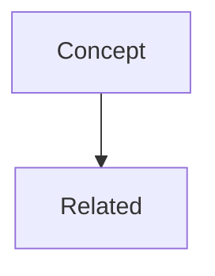

# KWDB Structure Analysis

Analysis of markdown file conventions and patterns in the kwdb repository.

---

## 1. File Naming Conventions

### Pattern Categories

| Pattern | Example | Usage |
|---------|---------|-------|
| `lowercase-kebab-case.md` | `tmux-knowledge.md` | Single-topic documents |
| `category--topic.md` | `dev-tools--git-best-practices.md` | Category-namespaced documents using double-dash separator |
| `topic-subtopic.md` | `shell-basics-taxonomy.md` | Compound topic names with single-dash |
| `UPPERCASE.md` | `README.md` | Standard project files |

### Naming Rules Observed

1. **All lowercase** except for README.md
2. **Hyphens as word separators** (kebab-case)
3. **Double-dash (`--`) as namespace separator** for category prefixes
4. **No spaces or underscores** in filenames
5. **Descriptive names** that indicate content scope

### Category Prefixes Used

- `dev-tools--` (2 files) - Development tooling and configuration

---

## 2. Document Structure and Formatting Patterns

### Title/Header Structure

| Document | H1 Title Style |
|----------|----------------|
| README.md | `# kwdb - Knowledge Database` (name + description) |
| tmux-knowledge.md | `# Tmux Knowledge Synthesis` |
| dev-tools--git-best-practices.md | `# AI Dev - Git Best Practices` |
| dev-tools--shell-path-configuration.md | `# Dev Tools - Shell PATH Configuration` |
| shell-basics-taxonomy.md | `# Shell Basics: Taxonomy and Mental Models` |
| context-engineering-for-ai-coding-agents.md | `# Context Engineering for AI Coding Agents` |
| validated-knowledge-synthesis-skill-build.md | `# Building the Validated Knowledge Synthesis Skill` |

**Pattern:** Single H1 title at top. Some include category prefix in title, others do not.

### Section Hierarchy

Standard depth: H1 > H2 > H3 > H4

Common H2 sections across documents:
- Context / Summary / Purpose
- Quick Reference
- Core concepts or main content sections
- FAQ
- References / Additional Resources

### Horizontal Rules

- Used as section separators (`---`)
- Common placement: after introductory paragraph, between major sections, before appendices/references

---

## 3. Content Organization Patterns

### Type 1: Reference Documents (tmux-knowledge.md)

```
# Title
Brief intro paragraph

---

## Quick Reference
[Tables with commands/shortcuts]

---

## Workflow Sections
[Prose explanations with examples]

---

## FAQ
[Q&A format]

---

## Source Validation
[Attribution table]
```

### Type 2: Problem-Solution Documents (dev-tools--*.md)

```
# Title

## Context
**Issue Identified:** [Problem statement]
[Code diff or example]

---

## Solution/Recommendations
### Step 1
[Explanation + code blocks]

### Step 2
[Continuation...]

---

## Quick Reference
[Summary commands/checklists]

---

## Additional Resources
[Links]
```

### Type 3: Conceptual Documents (shell-basics-taxonomy.md)

```
# Title
**Created:** date
**Topic:** description

---

## Concept Section
### Subsection
- Bullet points with explanations
- Definitions

---

## Session Metadata
[Meta-information about document creation]
```

### Type 4: VKS Curated Context (context-engineering-for-ai-coding-agents.md)

```
---
[YAML frontmatter]
---

# Title

## Purpose & Reader Context
[What you'll learn, what's expected]

---

## Section A: Core Concepts
### Concept Name
**Answer:** [Direct answer]
**Explain:** [Deeper context]
**Educate:** [Full understanding]

---

## Section B: Challenges & Solutions
### Challenge N: Title
**What:** [Problem]
**So What:** [Impact]
**Now What:** [Solution]

---

## Section C: Implementation Playbook
[Actionable templates and matrices]

---

## Appendices
### Glossary
### Key Principles
### Evidence and Citations

---

## Document Metadata
[Target audience, use cases, maintenance notes]
```

### Type 5: Build/Process Log (validated-knowledge-synthesis-skill-build.md)

```
# Title

## Summary
Brief paragraph + bullet points

## Skill Structure
[Directory tree in code block]

## Key Features
[Bullet list]

## Installation
[Step-by-step instructions]

## Usage
[Examples]

## Source
[Attribution]
```

---

## 4. Frontmatter and Metadata

### YAML Frontmatter

Only one document uses YAML frontmatter: `context-engineering-for-ai-coding-agents.md`

Frontmatter structure:
```yaml
---
# VKS Document Metadata
vks_version: "2.1"
document_type: "curated_context"
synthesis_date: "2025-12-28"
target_audience: "software engineers, engineering leaders"

# Source Provenance
source_type: "youtube_transcript"
source_url: "..."
source_video_id: "..."
source_title: "..."
source_channel: "..."
source_uploader: "..."
source_organization: "..."
source_duration: "..."
source_thumbnail: "..."

# Synthesis Details
synthesis_topic: "..."
synthesis_strategy: [list]
primary_frameworks: [list]
validation_status: "validated"
confidence_level: "high"

# Content Organization
primary_topics: [list]
key_concepts: [list]
related_concepts: [list]

# Usage Metadata
use_cases: [list]
estimated_read_time: "..."
last_validated: "..."

# File Relationships
source_files: [list]
related_documents: [list]
---
```

### Inline Metadata

- `shell-basics-taxonomy.md`: Uses bold key-value pairs at top (`**Created:** 2026-01-17`)
- `dev-tools--*.md`: Uses "Generated:" date at bottom
- Some documents include "Session Metadata" sections

### Source Validation Tables

Used in `tmux-knowledge.md`:
```markdown
## Source Validation

| Attribute | Assessment |
|-----------|------------|
| Source | tmuxcheatsheet.com |
| Authority | High - dedicated tmux reference |
| Recency | Current (2026-01-17) |
| Consistency | High - standard tmux commands |
| Coverage | Comprehensive |
```

---

## 5. Categories and Taxonomies

### Explicit Category System

Documents use double-dash (`--`) prefix for categorization:
- `dev-tools--` prefix for development tooling documents

### Implicit Topic Categories

Based on content analysis:

| Category | Documents |
|----------|-----------|
| Development Tools | dev-tools--git-best-practices.md, dev-tools--shell-path-configuration.md |
| Shell/Terminal | tmux-knowledge.md, shell-basics-taxonomy.md |
| AI/LLM Methodology | context-engineering-for-ai-coding-agents.md |
| Meta/Process | validated-knowledge-synthesis-skill-build.md |
| Project Overview | README.md |

### VKS-Specific Taxonomies

From frontmatter in VKS documents:
- `document_type`: curated_context, guidance, reference
- `source_type`: youtube_transcript
- `primary_topics`: list of topic tags
- `key_concepts`: list of concept terms
- `related_concepts`: list of related terms

---

## 6. Common Formatting Elements

### Tables

Used extensively for:
- Quick reference/cheat sheets (keyboard shortcuts, commands)
- Comparison matrices (HTTPS vs SSH, task complexity)
- Decision matrices
- Source validation attributes
- Configuration options

### Code Blocks

- Fenced with triple backticks
- Language hints: `bash`, `yaml`, `json`, `mermaid`, `diff`
- Used for: commands, configuration files, examples, directory trees

### Lists

- **Bullet lists**: Explanatory content, features, options
- **Numbered lists**: Sequential steps, priority rankings
- **Checklists**: `- [ ]` for action items and setup steps

### Bold/Emphasis

- `**Term:**` for key-value definitions
- `**Warning:**` for cautions
- Bold for emphasis within paragraphs

### Blockquotes

Used sparingly, primarily for quotations from external sources.

### Mermaid Diagrams

Used in VKS documents for conceptual data models:
```markdown


---

## 7. Cross-Referencing Patterns

### Internal References

- Relative file references: `See \`context-engineering-for-ai-coding-agents.md\` for full principles.`
- Markdown file references in prose: `dev-tools--git-best-practices.md`

### External References

- Full URLs in "Additional Resources" sections
- Inline links: `[Pre-commit hooks documentation](https://pre-commit.com/)`
- YouTube video IDs with links

---

## 8. Summary of Conventions

### File Naming

1. Use `lowercase-kebab-case.md`
2. Prefix with category + double-dash for namespacing: `category--topic.md`
3. Keep names descriptive but concise

### Document Structure

1. Single H1 title at top
2. Brief intro paragraph immediately after title
3. Horizontal rule (`---`) after intro
4. Logical H2 sections for major topics
5. H3 for subsections
6. Horizontal rule between major sections (optional)
7. Quick Reference section for actionable summaries
8. References/Resources at end

### Metadata

1. YAML frontmatter for formal VKS curated context documents
2. Inline bold metadata for simpler documents
3. Source validation tables for reference material
4. Generated date at bottom for change tracking

### Formatting

1. Tables for structured information (commands, comparisons)
2. Fenced code blocks with language hints
3. Bullet lists for explanatory content
4. Numbered lists for sequential steps
5. Checklists for action items
6. Bold for key terms and labels

### Content Frameworks

1. **Answer-Explain-Educate**: For concept definitions
2. **What-So What-Now What**: For problem-solution content
3. **Golden Path Criteria**: For progressive disclosure
4. **Quick Reference + Deep Dive**: For actionable + educational content

---

*Analysis date: 2026-01-17*
*Source: kwdb repository root markdown files*
