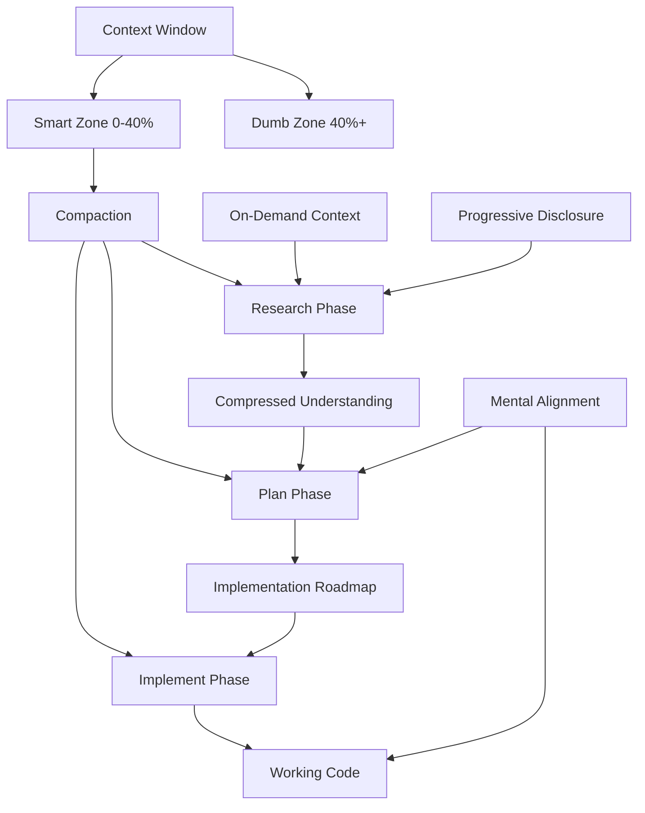

---
# VKS Document Metadata
vks_version: "2.1"
document_type: "curated_context"
synthesis_date: "2025-12-28"
target_audience: "software engineers, engineering leaders"

# Source Provenance
source_type: "youtube_transcript"
source_url: "https://www.youtube.com/watch?v=rmvDxxNubIg"
source_video_id: "rmvDxxNubIg"
source_title: "No Vibes Allowed: Solving Hard Problems in Complex Codebases"
source_channel: "AI Engineer"
source_uploader: "Dex Horthy"
source_organization: "HumanLayer"
source_duration: "1186s"
source_thumbnail: "No Vibes Allowed： Solving Hard Problems in Complex Codebases – Dex Horthy, HumanLayer [rmvDxxNubIg].webp"

# Synthesis Details
synthesis_topic: "context engineering for AI coding agents"
synthesis_strategy:
  - "convergent: context engineering principles unified into coherent framework"
  - "convergent: RPI workflow phases integrated as system"
  - "tension_preservation: task complexity decisions (when to use RPI vs simpler approaches)"
  - "tension_preservation: plan detail tradeoff (reliability vs readability)"
primary_frameworks:
  - "Answer-Explain-Educate"
  - "What-So What-Now What"
  - "Golden Path Criteria"
validation_status: "validated"
confidence_level: "high"

# Content Organization
primary_topics:
  - "context engineering"
  - "AI coding agents"
  - "workflow optimization"
  - "team collaboration"
key_concepts:
  - "smart zone vs dumb zone"
  - "compaction"
  - "research-plan-implement (RPI)"
  - "mental alignment"
  - "on-demand compressed context"
  - "progressive disclosure"
related_concepts:
  - "prompt engineering"
  - "agent workflow design"
  - "code review processes"
  - "technical leadership"

# Usage Metadata
use_cases:
  - "quick reference before complex AI-assisted coding tasks"
  - "team onboarding to context engineering practices"
  - "debugging poor AI output quality"
  - "deciding when to use RPI vs simpler approaches"
estimated_read_time: "15-20 minutes"
last_validated: "2025-12-28"

# File Relationships
source_files:
  - "No Vibes Allowed--- Solving Hard Problems in Complex Codebases -----Dex Horthy, HumanLayer (rmvDxxNubIg).en.InfoNug.28DEC25.064522.md_chapters.md"
related_documents: []
---

# Context Engineering for AI Coding Agents

## Purpose & Reader Context

You need AI coding assistants to solve complex problems in brownfield codebases without generating slop. This document shows you how. Context engineering manages what information enters your AI's context window and when. Better context creates better output. Master this and you ship 2-3x more code with higher quality.

**What you'll learn:** Core context principles, compaction techniques, research-plan-implement workflow, when to use each approach.

**What's expected of you:** Read this before tackling complex AI-assisted tasks. Apply the decision matrices. Review your plans before execution.

---

## Section A: Core Concepts and Entities

### Context Window (The Foundation)

**Answer:** The context window holds every token the AI sees when choosing its next action.

**Explain:** LLMs are stateless. They don't remember previous conversations. The only information influencing the next output is what sits in the current context window. Better tokens in means better tokens out.

**Educate:** Think of context like RAM for the AI. Fill it with the right information and the AI performs well. Fill it with noise, outdated docs, or error trajectories and performance degrades. Every tool call, file read, and conversation turn consumes context. You must manage this resource deliberately.

### Smart Zone vs Dumb Zone

**Answer:** The smart zone is roughly the first 40% of your context window where AI performs best. The dumb zone is everything beyond that threshold.

**Explain:** As context usage increases, AI output quality decreases. Around 40% context capacity (varies by model and task complexity), you cross into diminishing returns. At 60-70%+ usage, the AI struggles to make good decisions.

**Educate:** This isn't a hard limit. Simple tasks tolerate higher context usage. Complex architectural decisions need clean, compact context. If you load too many MCP tools into your coding agent, you operate entirely in the dumb zone and never get good results.

### Compaction (The Core Technique)

**Answer:** Compaction compresses context into smaller, denser representations without losing essential information.

**Explain:** Take your current context window and ask the AI to summarize it into a markdown file. This includes relevant file paths, line numbers, code flow understanding, and decisions made. The next agent starts with this compressed knowledge instead of rediscovering everything.

**Educate:** Compaction removes noise while preserving truth. It eliminates redundant file reads, failed exploration paths, and verbose tool outputs. The result focuses the AI on what matters. Think of it as trading dozens of verbose tool calls for a few paragraphs of precise context.

### Research-Plan-Implement (RPI Workflow)

**Answer:** RPI is a three-phase workflow that keeps context compact through intentional phase boundaries.

**Explain:**
- **Research phase:** Understand how the system works, find relevant files, stay objective
- **Plan phase:** Outline exact steps with file names and line snippets, specify testing approach
- **Implement phase:** Execute the plan, keeping context focused on current step

**Educate:** Each phase ends with compaction. Research produces a compressed understanding of the codebase. Planning produces a detailed implementation roadmap. Implementation follows that roadmap. By creating these boundaries, you avoid bloating any single context window with everything at once.

### Mental Alignment

**Answer:** Mental alignment keeps all team members synchronized on how the codebase changes and why.

**Explain:** Code review isn't just about finding bugs. It keeps the team on the same page. When shipping 2-3x more code with AI, you need new alignment mechanisms. Plans serve this purpose. A teammate can read your plan faster than reviewing a thousand lines of code.

**Educate:** As your team adopts AI coding, you shift review earlier in the process. Review the research and plan before implementation. Catch problems when they're still cheap to fix. Share your conversation threads in PRs so reviewers follow your journey, not just see the final diff.

### Conceptual Data Model



**Key Relationships:**
- Context Window contains Smart and Dumb Zones
- Compaction creates phase boundaries
- Each phase produces compressed artifacts
- Research feeds Planning, Planning feeds Implementation
- Mental Alignment happens through plan review
- On-demand context and progressive disclosure optimize research

---

## Section B: Challenges & Solutions

### Challenge 1: Context Bloat Kills Performance

**What:** You start a task, read files, search code, run builds. Context grows with every action. By the time you need the AI to make critical decisions, you're deep in the dumb zone.

**So What:** The AI makes poor choices because signal-to-noise ratio collapsed. You get generic suggestions, missed edge cases, or code that doesn't fit existing patterns. This creates the "rework cycle" where you ship code one week and fix it the next.

**Now What:** Use intentional compaction. Don't let context drift beyond 40% before compacting. Start new contexts when you get off track instead of arguing with the AI. Each new context inherits compressed knowledge from the previous one, not the full conversation.

### Challenge 2: The Correction Death Spiral

**What:** You tell the AI to do something. It does it wrong. You correct it. It does something else wrong. You correct harder. The pattern repeats.

**So What:** The conversation trajectory teaches the AI that errors followed by corrections are the expected pattern. The next most likely token becomes "do something wrong so the human can correct me again."

**Now What:** Start over with a fresh context when you get off track. Include what didn't work in the new prompt, but don't carry the error trajectory forward. The new context should show success patterns, not failure patterns.

### Challenge 3: Static Documentation Lies

**What:** You maintain internal docs, context files, or onboarding materials for the AI. These describe how the codebase works. They get out of sync with the actual code.

**So What:** The AI receives incorrect information as ground truth. It makes decisions based on lies. The more comprehensive your static docs, the more surface area for inaccuracy. Function names change, architecture evolves, docs lag behind.

**Now What:** Use on-demand compressed context instead of static docs. When starting a task, research the specific parts of the codebase you need right now. Compress that research into a document. This captures current truth because it comes directly from the code, not from documentation that might be stale.

### Challenge 4: Knowing When to Use RPI

**What:** Research-plan-implement workflow adds overhead. You need to know when that overhead pays off versus when simpler approaches work better.

**So What:** Using full RPI for trivial tasks wastes time. Skipping RPI for complex tasks generates slop. You need clear decision criteria.

**Now What:** Use this matrix:

| Task Type | Example | Approach | Why |
|-----------|---------|----------|-----|
| Trivial | Change button color | Direct prompt | One file, obvious change, no research needed |
| Simple | Add validation to existing form | Light planning | Known patterns, might skip research |
| Medium | Add feature across 2-3 files | Research + Plan | Need to understand integration points |
| Complex | Refactor authentication system | Full RPI | Multiple repos, architectural decisions |
| Exploratory | Remove Hadoop from Parquet Java | Research → Whiteboard | RPI can't replace architectural thinking |

### Challenge 5: Plan Quality vs Readability Tradeoff

**What:** Detailed plans improve AI execution reliability. Verbose plans reduce human readability for mental alignment. You must balance both.

**So What:** Too brief and the AI guesses, generating slop. Too detailed and teammates won't read plans, losing mental alignment benefits.

**Now What:** Include actual code snippets of what will change. Be specific about file paths and line numbers. Test your plan by asking: "Can I read this and predict what code changes will happen?" If yes, it's detailed enough. If it takes more than 5 minutes to read, it might be too detailed for your team. Find your team's sweet spot through iteration.

### Challenge 6: Sub-Agent Misuse

**What:** Teams create "frontend sub-agent," "backend sub-agent," "QA sub-agent" to anthropomorphize roles.

**So What:** This misses the point. Sub-agents exist for context control, not role-playing.

**Now What:** Use sub-agents to fork expensive operations into separate context windows. Example: Main agent needs to understand how SCM providers work. It spawns a research sub-agent. That sub-agent reads files, searches code, builds understanding. It returns a succinct summary. Main agent reads one summary instead of loading dozens of files. Sub-agents compress exploration into compact results.

---

## Section C: Implementation Playbook

### Decision Matrix: Choosing Your Approach

**Start here:** Before beginning any AI-assisted task, answer these questions:

1. **Codebase familiarity:** Do you understand this part of the system?
   - Yes → Skip or lighten research phase
   - No → Full research phase

2. **Task scope:** How many files will this touch?
   - 1 file → Direct prompting likely sufficient
   - 2-3 files → Consider planning
   - 4+ files or multiple repos → Full RPI

3. **Complexity:** How many architectural decisions required?
   - None (pattern already exists) → Light or no planning
   - Some (new patterns needed) → Full planning
   - Many (system redesign) → RPI + whiteboard thinking

4. **Risk level:** What happens if this ships with bugs?
   - Low impact → Direct prompting acceptable
   - Medium impact → Use planning for review
   - High impact → Full RPI with peer review

### Research Phase Template

Use this prompt structure:

```
Research Task: [Specific question about the codebase]

Objective: Understand how [system/feature] works and locate the relevant files.

Stay objective. Don't propose solutions yet. Focus on:
- How does [X] currently work?
- Which files and line numbers handle [Y]?
- What are the key integration points?
- What patterns does this codebase use for [Z]?

Output: Markdown document with:
- System overview (2-3 paragraphs)
- Key files with line number ranges
- Data flow or control flow diagram
- Integration points and dependencies
```

**Research Output Quality Check:**
- Contains specific file paths and line numbers?
- Describes current state without proposing changes?
- Identifies patterns used in this codebase?
- Small enough to include in next phase's context?

### Planning Phase Template

Use this prompt structure:

```
Planning Task: [Feature or fix description]

Context: [Attach research document from previous phase]

Create a detailed implementation plan with:

1. Overview (what we're building and why)
2. Approach (high-level strategy)
3. Step-by-step implementation:
   - File path and line numbers to change
   - Code snippets showing what to change
   - Testing approach after each change
4. Edge cases and error handling
5. Manual testing checklist

Make the plan specific enough that implementation becomes mechanical.
```

**Plan Output Quality Check:**
- Can you predict the actual code changes from reading this?
- Does it specify testing after each change?
- Would a teammate understand the approach from this plan?
- Is it readable in under 5 minutes?

### Implementation Phase Template

Use this prompt structure:

```
Implementation Task: Execute the plan

Context: [Attach plan document]

Follow the plan step by step. After each step:
1. Make the code change
2. Run the tests specified in the plan
3. Report results before proceeding

If tests fail or unexpected issues arise, stop and report. Don't improvise solutions.
```

**Implementation Quality Signals:**
- AI follows plan without major deviations?
- Tests pass after each step?
- Context usage stays in smart zone?
- No need to argue or correct the AI?

### Compaction Trigger Checklist

Compact your context when ANY of these occur:

- [ ] Context usage exceeds 40%
- [ ] AI suggests something obviously wrong
- [ ] You've corrected the AI twice on the same issue
- [ ] You're transitioning phases (research → plan → implement)
- [ ] You want to fork a sub-agent for exploration
- [ ] The conversation has drifted from the original goal

### Progressive Disclosure Pattern

For large codebases, use hierarchical context:

```
/repo-root/.context.md          # High-level architecture, tech stack
/feature-area/.context.md       # Feature-specific patterns, conventions
/specific-module/.context.md    # Module details, gotchas
```

Your AI coding tool loads context progressively:
1. Start with root context
2. As you navigate deeper, load relevant sub-context
3. Context stays compact because you only load what you need

**Warning:** Keep these up to date or don't use them. Stale context is worse than no context.

### Team Adoption Strategy

**For Individual Contributors:**

1. Pick one AI coding tool. Get 200 hours of practice.
2. Start with simple tasks. Build intuition for when to compact.
3. Share good plans with teammates. Build shared understanding.
4. Review your own context usage. Notice when you drift into dumb zone.
5. Track metrics: How often do you rework AI-generated code?

**For Technical Leaders:**

1. Model the behavior. Use RPI for your own work. Share plans.
2. Create shared prompt templates. Lower the barrier to adoption.
3. Make plan review part of your PR process.
4. Track team metrics: Lines shipped, rework percentage, review time.
5. Address the cultural gap: Senior engineers rejecting AI while juniors generate slop creates a toxic cycle. Break it by showing high-quality AI-assisted work from senior folks.

**Cultural Change Warning:** This requires top-down support. Mid-level engineers can't fix a process where seniors reject AI and juniors generate unchecked slop. Leadership must set standards and model good practices.

### Conversation Thread in PRs

When you open a PR with AI-generated code:

1. Include your research document (if created)
2. Include your plan document (if created)
3. Include key conversation snippets showing:
   - What you asked for
   - How the AI approached it
   - What tests you ran
   - What manual validation you performed

This takes reviewers on the journey. They see your thinking, not just the final diff. Review time drops because context is clear.

### When RPI Isn't Enough

Sometimes you hit RPI's ceiling. Signals:

- Research reveals the problem is more complex than expected
- Multiple failed plan attempts
- You can't articulate what the AI should do
- Architectural decisions have unclear tradeoffs

**What to do:** Stop using the AI. Use a whiteboard. Talk to teammates. Understand the problem space. Once you're clear on approach, THEN use AI to implement. Don't outsource the thinking.

---

## Appendices

### Glossary

**Compaction:** Compressing a context window into a smaller, denser representation without losing essential information.

**Context Window:** All tokens (conversation, tool calls, file contents, etc.) the AI can see when generating its next response.

**Dumb Zone:** Region beyond ~40% context usage where AI performance degrades due to noise-to-signal ratio.

**Mental Alignment:** Team synchronization on how the codebase evolves, traditionally achieved through code review, now also through plan review.

**On-Demand Compressed Context:** Research produced just-in-time for a specific task, compressed from current codebase state rather than static documentation.

**Progressive Disclosure:** Hierarchical context loading strategy that reveals more detail as you navigate deeper into a codebase.

**RPI:** Research-Plan-Implement workflow with intentional compaction between phases.

**Smart Zone:** Region below ~40% context usage where AI performs optimally.

**Slop:** Low-quality AI-generated code that requires rework, often produced when context is poorly managed or thinking is outsourced to the AI.

**Sub-Agent:** Separate context window forked to handle expensive operations (research, exploration) and return compact results to the parent agent.

**Trajectory:** The pattern of conversation turns that influences future AI outputs (success patterns vs error-correction patterns).

### Key Principles (Quick Reference)

1. **LLMs are stateless:** Context is everything. Better context creates better output.
2. **Avoid the dumb zone:** Keep context usage below 40% when possible.
3. **Compact intentionally:** Create phase boundaries to prevent context bloat.
4. **Preserve trajectories:** Show success patterns, not error-correction spirals.
5. **Don't outsource thinking:** AI amplifies your thinking, it doesn't replace it.
6. **Mental alignment through plans:** Share research and plans, not just final code.
7. **On-demand beats static:** Generate fresh context from code, don't rely on stale docs.
8. **Sub-agents manage context:** Use them for exploration, not role anthropomorphization.
9. **Match approach to complexity:** Trivial tasks need no RPI, complex tasks need full RPI.
10. **Cultural change needs leadership:** Adoption fails without top-down support and modeling.

### Evidence and Citations

**Source:** "No Vibes Allowed: Solving Hard Problems in Complex Codebases" - Dex Horthy, HumanLayer CEO, AI Engineer Conference December 2025

**Key Empirical Claims:**
- Team achieved 2-3x throughput increase using context engineering techniques
- Shipped 35,000 lines to production BAML codebase in 7 hours (estimated 1-2 weeks of traditional work)
- Successfully contributed production-quality PR to 300,000-line Rust codebase using RPI workflow
- Survey of 100,000 developers (referenced from Igor's presentation) showed high rework rates when AI is used without process discipline

**Model-Specific Details:**
- 40% dumb zone threshold: Claude Code with ~168,000 token context window
- Varies by model and task complexity
- Your mileage may vary; find your own thresholds through experimentation

---

## Document Metadata

**Target Audience:** Software engineers (ICs) and engineering leaders adopting AI coding assistants

**Use Cases:**
- Quick reference before tackling complex AI-assisted coding tasks
- Onboarding team members to context engineering practices
- Debugging poor AI output quality
- Deciding when to use RPI vs simpler approaches

**Maintenance:** This document synthesizes a conference talk from December 2025. Core principles likely remain stable, but specific tool features and thresholds may change as AI coding assistants evolve.

**Related Concepts:**
- Prompt engineering
- Agent workflow design
- Code review processes
- Technical leadership in AI-augmented teams

**Acknowledgments:** Synthesized from Dex Horthy's presentation at AI Engineer Conference. Research-Plan-Implement prompts are open source and available through HumanLayer's GitHub.