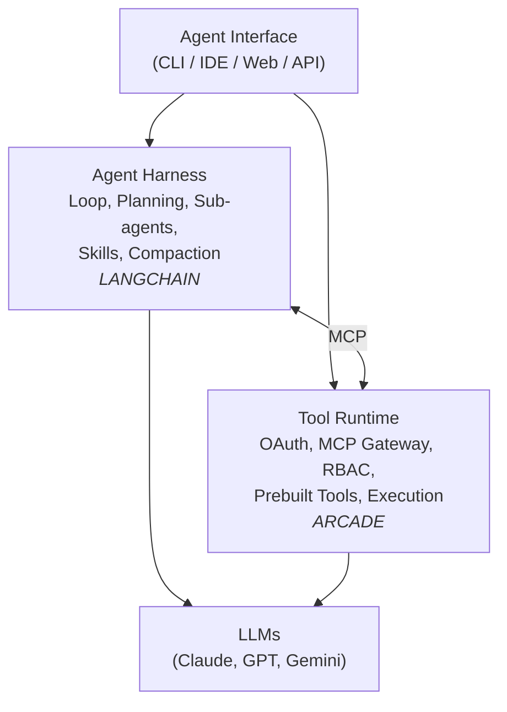

# Agentic Infrastructure: Harnesses, Tool Runtimes, and the Agent Stack

> Synthesized from a joint talk by **Harrison Chase** (Founder, LangChain) and **Sam Partee** (CTO, Arcade.dev) at the Coding Agents: AI Driven Dev Conference (Computer History Museum, 2026). Low-quality recording/transcription cross-validated against 20 slide photographs.

---

## Source Validation

| Source | Type | Quality | Notes |
|--------|------|---------|-------|
| Slide photographs (x20) | Primary visual | High | Clear captures of every major slide; anchor for transcript correction |
| Transcript | Primary audio | Low | Automated transcription of poor recording; heavy garbling of proper nouns ("Asian harness" = agent harness, "Deep Adrums" = Deep Agents, etc.) |
| Luma event page | Context | Medium | Confirms speakers, venue, and conference framing |

**Synthesis strategy**: Slides treated as ground truth for terminology, architecture, and claims. Transcript fills in spoken reasoning, Q&A nuance, and opinions not captured on slides. Convergent where both agree; transcript-only claims flagged as lower confidence.

---

## Core Concepts

### The Three-Layer Agent Abstraction

An agent is an LLM running in a loop calling tools. Everything above that base definition adds "batteries." The industry converges on three layers of abstraction, each serving a different need.

| Layer | Package | Provides | Use When | Alternatives |
|-------|---------|----------|----------|-------------|
| **Runtime** | LangGraph | Durable execution, streaming, HITL, persistence | Low-level control; long-running stateful workflows | Temporal, Inngest |
| **Framework** | LangChain | Abstractions, integrations | Getting started fast; standardizing how a team builds | AI SDK, LlamaIndex, CrewAI, Google SDK, OpenAI Agents SDK |
| **Harness** | Deep Agents | Predefined tools, prompts, subagents | Autonomous agents facing complex, non-deterministic tasks | Claude Agent SDK |

The runtime handles infrastructure. The framework handles developer ergonomics. The harness handles agent autonomy. You can use any layer independently, but production agents typically need all three.



### Agent Harness Components (Harrison Chase)

The harness wraps the base agent loop with six categories of built-in capability.

#### File System Protocol

Six tools define how the agent interacts with files: **ls**, **read_file**, **write_file**, **edit_file**, **glob**, **grep**. This set mirrors Claude Code closely. Codex uses a smaller subset (read, write) and falls back to bash for the rest.

Key differentiator in Deep Agents: **pluggable file system backends**. The agent always uses the same six tools, but the backend can be:

- Local machine filesystem (like Claude Code)
- LangGraph state (in-memory)
- Long-term store (database)
- Custom filesystem (sandbox, remote)

This abstraction enables remote execution. The agent writes "files" to a database. It doesn't know the difference.

#### Planning Tool

A simple tool that asks the LLM to generate a plan and holds it in the context window. It doesn't persist the plan to disk — the plan exists only as context for future generations. Other harnesses (notably Claude Code) write plans to Markdown files for more durable persistence. Both approaches work. The in-context approach is lighter; the file approach survives compaction.

#### Sub-agents

The main agent spawns sub-agents via a task tool. Each sub-agent gets **context isolation**: it sees only its assigned task, not the parent's full history. The parent sees only the sub-agent's final result, not its intermediate work. This enables parallel execution — spin up a Code sub-agent, a Research sub-agent, and a General sub-agent simultaneously.

Communication breakdown is the primary failure mode. The parent must specify tasks precisely. The sub-agent must return the right information. Vague delegation produces vague results.

#### Skills

Packaged bundles of instructions and tools, stored as folders on disk. Each skill has a `SKILL.md` file (metadata + instructions) and optional code files. Skills support lazy discovery — the agent finds and loads them as needed rather than loading everything at startup.

```
skills/
├── langgraph-docs/
│   └── SKILL.md
└── arxiv_search/
    ├── SKILL.md
    └── arxiv_search.py
```

#### Context Engineering

Two mechanisms prevent context window blowup:

**Offloading**: When a tool returns a massive result, the harness writes it to the filesystem, shows the agent the first ~100 lines, and says "read the file if you need more." This keeps the context window lean while preserving access to full data.

**Compaction**: At a threshold relative to context window size, the harness runs a summarization step. Original messages get saved to the filesystem (`/conversation_history/{thread_id}.md`). A condensed summary with a file pointer replaces earlier messages in context. The agent can read the originals if it needs detail. They're also exploring giving the agent a tool to trigger its own compaction — more LLM control over its own context window.

#### Human in the Loop

Built on LangGraph's interrupt primitives. Each tool can be flagged as requiring human approval before execution. The flow: Agent proposes action -> Interrupt check -> If yes: Human reviews -> Approve / Edit / Reject -> Execute or loop back. Write operations default to requiring approval in Agent Builder.

---

### Tool Runtime Components (Sam Partee)

The harness handles what the agent does locally. The tool runtime handles everything external — third-party services, authentication, authorization, and execution on behalf of users.

#### The Core Problem

You can't just add tools to an agent. Every external action requires answering two questions: **who is this user?** (auth) and **what can they do?** (authorization). A flight-booking agent needs to check calendars (auth), search flights (integration), pay (auth + integration), and notify Slack (auth + integration). Each step touches different services with different auth models.

#### Two Ways Agent Security Fails

| Pattern | Problem | Consequences |
|---------|---------|-------------|
| **Agent gets own identity** ("I am AgentBot1") | What permissions does the agent get? | Any user inherits agent's permissions. Low-privilege users access high-privilege data. Can't audit which user did what. |
| **Agent uses service accounts** (svc_agent) | Service account has broad access | No way to know which user triggered action. Shared credentials = no accountability. Must pre-provision with broad scope. |

Both patterns produce agents that are either dangerously over-privileged or uselessly under-privileged.

#### Delegated Agent Authorization

Arcade's solution: the agent never holds a user token. Instead, it holds a **scoped, just-in-time capability** — a subset of the user's permissions for a specific action, at a specific time, for a specific service.

Flow:
1. User says "send email"
2. Agent calls Send Email tool
3. Arcade Runtime **checks**: does this user have access to this tool?
4. Arcade Runtime **scopes**: identifies only the permissions this action needs
5. Arcade Runtime **issues**: JIT auth URL with "Send Email" scope
6. User authorizes (if required)
7. Arcade Runtime **executes**: tool runs using user's token
8. **Token never enters agent context or reaches the LLM**

This gives agents the same security posture that CISOs approved for web apps over the last 15 years. The agent acts **as the user**, not for the user — sending emails as you, not from a bot account.

#### Tool Definition with Scoped Auth

```python
@tool(requires_auth=Reddit(scopes=["read", "identity"]))
async def identity_tool(context: Context) -> dict:
    oauth_token = context.get_auth_token_or_empty()
    headers = {
        "Authorization": f"Bearer {oauth_token}",
        "User-Agent": "mcp_server-mcp-server",
    }
```

Each tool declares the exact scopes it needs. Secrets can be scoped to org, project, or user level. Secrets live in a secret store, not environment variables.

#### Contextual Tool Access

A pipeline wrapping every tool execution inside the Arcade MCP Runtime:

| Stage | Purpose | Enterprise Integrations |
|-------|---------|------------------------|
| **Access Hook** | Who can use which tools? | Tool Access Policies |
| **Pre Hook** | Validate inputs before execution | Snyk (input validation), SailPoint (prompt injection scan) |
| **Tool Run** | Execute the tool | — |
| **Post Hook** | Scan outputs before returning to LLM | Okta (PII redaction), toxic flow detection |

This hooks into existing enterprise entitlement systems. If you already have PII detection or named entity recognition, you plug it in at the pre/post hook layer rather than replacing it.

#### MCP Gateway

Aggregates multiple MCP servers into a single endpoint. Pick tools from across services (Confluence, GitHub, Microsoft Teams, Outlook, Sharepoint) and serve them as one MCP server on the internet, securely. The demonstrated configuration: 82 tools from 6 toolkits, accessible via a single URL slug that plugs directly into LangChain or any MCP client.

#### Full Architecture

```
LLM Providers <-> Agents (LangChain, Agents SDK | Cursor, Claude, ChatGPT)
                      |
                  MCP Gateway
                      |
        Arcade / Custom / Third Party MCP Servers
                      |
    Runtime Core: Tool Search, Tool Registry,
    Contextual Tool Access, Auth & Token Mgmt
                      |              |
            Governance Layer    Authorization Servers
                                (Google, Microsoft, GitHub)
                      |
         Enterprise Systems / Endpoints
    (Databases, APIs, Business Apps, SaaS, Storage,
     Remote MCP Servers)
```


[[GenAI/Latent-Patterns/z_attachments/Pasted image 20260306123541.png|Open: Pasted image 20260306123541.png]]
![[GenAI/Latent-Patterns/z_attachments/Pasted image 20260306123541.png|600]]

---

## Challenges & Solutions

### Agent Identity: Delegated vs. Own

**What**: Two models emerge for how agents authenticate to external services. Delegated authorization (Arcade's model) passes a scoped subset of user permissions. Own-identity agents (seen in [OpenClaw](https://github.com/openclaw)) get their own credentials, memory, and persistent identity.

**So What**: This is an unsettled architectural decision with major implications. Delegated auth fits enterprise security postures — CISOs approve it because it mirrors existing web app models. Own-identity agents enable richer behaviors (persistent memory per agent, autonomous background work) but create new attack surfaces and governance questions. Harrison Chase noted [OpenClaw](https://github.com/openclaw)'s agent-identity model was "really interesting, and not at all what we'd seen previously."

**Now What**: In an interview, frame this as a **tension worth preserving**, not a problem to solve. Both models will coexist. Enterprise agents that act on behalf of employees need delegated auth. Consumer-facing agents that accumulate their own relationships and memory need their own identity. The hard question: what happens when an agent with its own identity needs to access a user's resources? That intersection is unsolved.

### Context Window as Scarce Resource

**What**: Agents consume context rapidly. A single tool call can return thousands of lines. Long conversations compound the problem.

**So What**: Without active management, agents hit context limits mid-task and lose critical information. Every coding agent harness now builds context engineering as a first-class concern, not an afterthought.

**Now What**: Three patterns now standard:
1. **Offload** large tool results to filesystem, show preview
2. **Compact** older conversation turns via summarization, preserve originals on disk
3. **Give the LLM control** over its own context (self-triggered compaction, selective file reads)

The trajectory points toward agents that manage their own memory hierarchy — context window as L1 cache, filesystem as L2, long-term store as L3.

### Enterprise Permissions at Scale

**What**: A real scenario raised in Q&A: a manager goes on vacation, their agent runs an Ansible playbook, but the replacement manager lacks the permissions to continue the workflow. Worse: what if the original user gets fired and their token is revoked mid-workflow?

**So What**: Agent authorization isn't a one-time gate. It's a continuous evaluation. Tokens expire, users change roles, permissions shift. Any production agent system needs token revocation, step-up authorization flows, and delegation chains.

**Now What**: This is where the tool runtime earns its complexity. Arcade's per-action scoping means revoking a user's token instantly kills all their agent's capabilities. Step-up auth lets a new user authorize themselves into an existing workflow. None of this is simple, but it maps to patterns IAM teams already understand.

---

## Practical Application

### Decision Matrix: Choosing Your Agent Stack Layer

| You Need | Choose | Why |
|----------|--------|-----|
| Full control over agent execution flow | LangGraph (Runtime) | Durable execution, custom state machines |
| Quick start with standard patterns | LangChain (Framework) | Abstractions, integrations, team standardization |
| Autonomous agents with batteries included | Deep Agents (Harness) | Planning, sub-agents, skills, compaction built in |
| Secure third-party tool execution | Arcade (Tool Runtime) | Delegated auth, MCP gateway, contextual access |
| No-code agent creation | Agent Builder | Combines harness + runtime, 8000+ tools, templates |

### Interview-Ready Mental Models

**"Harness vs. Runtime"**: The harness controls what the agent thinks and does locally (planning, sub-agents, context management). The runtime controls what the agent does externally (auth, tool execution, enterprise integration). MCP connects them. Neither replaces the other.

**"Files as the universal interface"**: Agent definitions live as files (agent.md, skills/, mcp.json). Agent memory modifies files. Context compaction saves to files. Tool results offload to files. The filesystem is the agent's primary state substrate — even when the "filesystem" is actually a database.

**"Doing work AS the user, not FOR the user"**: The key insight from Arcade's delegated auth. Sending an email as you (with your OAuth token, scoped to send-only) vs. sending from a bot account. Enterprise adoption hinges on this distinction.

**"The hyperscaler bundling threat"**: The final slide positions LangChain + Arcade as "the only open, production-ready alternative to hyperscaler bundling." This refers to hyperscalers (Google AgentCore, etc.) vertically integrating harness + runtime + tools. The open ecosystem counter-argument: composability and vendor independence.

### Key Terminology Quick Reference

| Term | Definition |
|------|-----------|
| **Agent Harness** | Batteries-included wrapper around the LLM loop — adds planning, tools, sub-agents, skills, context management |
| **Tool Runtime** | Infrastructure for secure, authenticated execution of external tools on behalf of users |
| **Deep Agents** | LangChain's agent harness product (open source, built on LangGraph) |
| **MCP** | Model Context Protocol — standard interface between agent harnesses and tool servers |
| **MCP Gateway** | Aggregator that combines multiple MCP servers into a single secure endpoint |
| **Delegated Agent Authorization** | Auth pattern where agents receive scoped, JIT subsets of user permissions — never raw tokens |
| **Contextual Tool Access** | Pre/post hook pipeline around tool execution for policy enforcement, input validation, output scanning |
| **Compaction** | Summarizing older conversation turns and saving originals to disk to free context window space |
| **Pluggable Backends** | Filesystem abstraction allowing the same agent tools to target local disk, databases, or remote sandboxes |
| **Agent Builder** | No-code interface for creating agents by chatting — modifies agent definition files (agent.md, skills, mcp.json) behind the scenes |
| **Agent Identity** | Emerging pattern (seen in [OpenClaw](https://github.com/openclaw)) where agents have their own credentials and persistent memory, vs. acting on delegated user permissions |

### Speculative / Forward-Looking Claims (Lower Confidence)

These come from Q&A and spoken asides, not slides. Treat as directional signals, not confirmed product plans.

- LangChain exploring **agent-triggered compaction** — LLM decides when to compress its own context
- **Event-driven agents** running in background, pushing notifications to users when they need approval (vs. user polling)
- Agent identity as a **first-class concept** is very early; Harrison: "I don't know what it means, and I'll probably figure out in 90 days"
- Open source models **not yet reliable enough** to drive agent harnesses effectively; Claude and GPT still dominate for tool-use quality
- **Channels** (a la iMessage/Slack) emerging as an agent communication pattern — not just MCP, but bidirectional persistent threads
- People buying **Mac Minis for iMessage access** (Blue Bubble) to give agents CLI access to messaging — skills can package this
